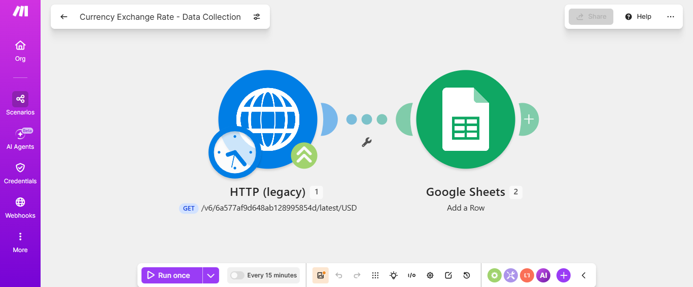

# Currency Exchange Rate Automation 

Automated pipeline that collects live USD exchange rates and logs them into Google Sheets, feeding a Power BI dashboard for dynamic currency conversion — no more static, hardcoded rates.

## How It Works

```
Schedule Trigger → HTTP GET (ExchangeRate-API) → Google Sheets (Add Row) → Power BI
```

1. Scenario runs on a schedule.
2. HTTP module calls `ExchangeRate-API` (`v6/latest/USD`) and retrieves live conversion rates.
3. A new row (Date, USD, INR Rate, EUR Rate) is appended to Google Sheets.
4. Power BI reads the sheet and uses the latest rates for dynamic currency conversion.

## Tools

- **Make.com** – automation/orchestration
- **ExchangeRate-API** – live exchange rate data
- **Google Sheets** – timestamped, append-only data log

## Sheet Structure

| Date | USD | INR Rate | EUR Rate |
|---|---|---|---|
| 2026-07-05 12:00:00 | 1 | 83.45 | 0.92 |

## Setup

1. Get a free API key from [ExchangeRate-API](https://www.exchangerate-api.com/).
2. In Make.com, add an **HTTP** module (GET) → `https://v6.exchangerate-api.com/v6/YOUR_API_KEY/latest/USD`
3. Add a **Schedule** trigger (e.g., daily).
4. Add a **Google Sheets → Add a Row** module, mapping `{{now}}`, `{{conversion_rates.USD}}`, `{{conversion_rates.INR}}`, `{{conversion_rates.EUR}}`.
5. Connect the sheet to Power BI as a data source.

## Outcome

Power BI always reflects current exchange rates — no manual updates, no stale hardcoded values.
